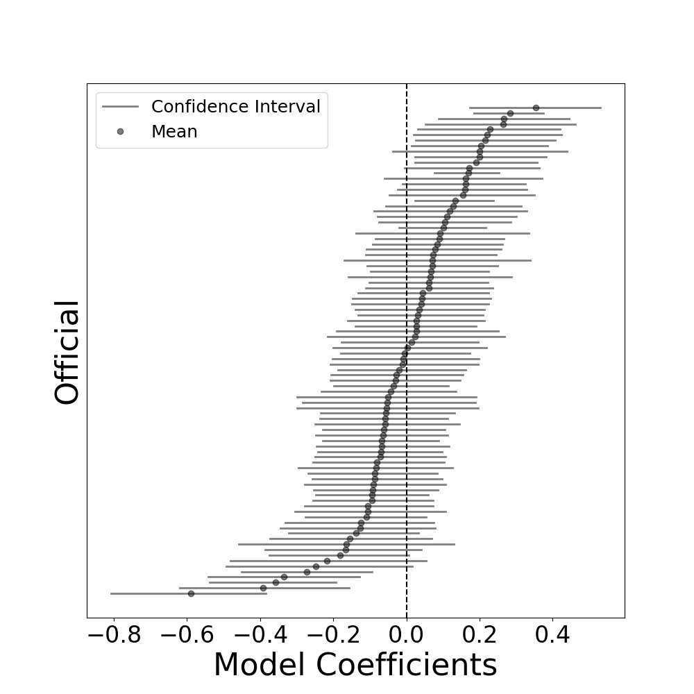

# nba_official_evaluation
Leveraging Last Two Minute report and Coach's Challenge data to evaluate NBA officials

Simply run:

```
python official_quality.py
```

to construct the model and generate the figures.

## Abstract

This paper details a methodology to evaluate the quality of NBA officials using data available from Last Two Minute (L2M) reports and Coach's Challenge results. These data sources contain league assessments of decisions made by officials and includes a determination whether a play was incorrectly officiated. While much research considers the question of whether different sources of bias affect the calls made by NBA officials, this work explicitly attempts to measure the quality of each official by determining their effect on call or no-call (play) accuracy, which interests teams and fans alike.  

Using L2M reports from the 2018-19 through 2021-22 regular seasons along with new Coach's Challenge results from the 2019-20 and 2020-21 regular seasons, these officiating determinations serve as the output for a  classification model to predict the probability that a given play is officiated correctly. Along with the type of play, the model considers random referee effects, similar to the methodology for the Regularized Adjusted Plus-Minus (RAPM) metric designed for player evaluation. This model structure allows for the estimation of confidence intervals for each official's effect, which can be used to estimate the change in the odds of a play being officiated correctly when a given official is working a game and holding all other inputs constant. These effects are shown in the figure below.

The results indicate that the impact of individual officials on the odds that a play is officiated correctly ranges from a 45% reduction to a 42% increase relative to an average official. By resampling with replacement plays from the 4th quarter of games with L2M reports, the estimated number of incorrect calls rises from one to nearly three when moving from the highest to lowest quality official, assuming the other two game officials are average. Because the league allows teams to provide direct feedback on officials, these findings could ensure that teams objectively calibrate their evaluations. Team official rankings comprise part of the criteria for official playoff assignments, so having a system to rate official quality could help teams avoid bias and increase the likelihood that better officials work and advance in the playoffs. In the aggregate, officials that received 2020 and 2021 NBA playoff assignments had higher referee effects than those that did not, providing an additional level of validation for this model. This method of providing an evaluation of official quality could, if leveraged by teams and the NBA, have a positive impact on the officiating quality in the NBA moving forward, a proposition that affects all stakeholders in the sport.


